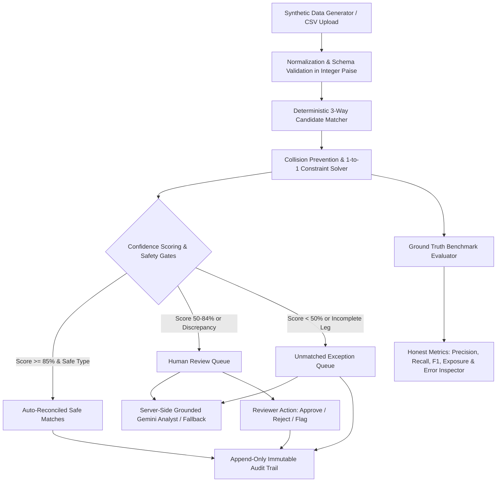

# ShaRecon AI

> **Explainable reconciliation. Confident financial control.**  
> *Built for the Razorpay AI Buildathon (Track: AI Finance Controller)*

---

## 🌟 Executive Summary

Merchants operating at scale face daily reconciliation friction connecting customer payments captured in Razorpay, nodal gateway settlement batches, and merchant bank account credits. References are frequently truncated, dates diverge due to banking holidays or cutoffs, amounts reflect fee tiers (2.0% to 3.5%) and 18% GST deductions, and deposits may be delayed, duplicated, or missing.

**ShaRecon AI** is a production-ready financial reconciliation platform and AI Finance Controller. It processes multi-leg transaction streams with **strict integer-paise arithmetic**, a **deterministic 4-factor scoring engine**, **1-to-1 collision prevention safeguards**, and a **grounded Gemini 2.5 Flash exception analyst** backed by a 100% reliable offline fallback.

---

## 🏛️ System Architecture



---

## ✨ Key Capabilities

### 1. Integer-Paise Financial Precision
- Eliminates floating-point rounding errors by enforcing `1 INR = 100 paise` across all ledger calculations, fee deductions, and delta comparisons.

### 2. Explainable Deterministic Matching
- **4-Factor Evidence Breakdown**:
  - **Reference Match (40 pts)**: Exact payment ID, order ID, or partial reference.
  - **Amount Compatibility (35 pts)**: Expected net vs settled amount vs bank credit.
  - **Date Window Proximity (15 pts)**: T+0 to T+3 calendar delta scoring.
  - **UTR & Description Similarity (10 pts)**: Alphanumeric UTR validation & token overlap.
- Every result produces a plain-English, traceable audit explanation (e.g., *"Matched with 98% confidence: Exact Payment ID ref (pay_0001_razor) verified. Net settled amount matches expected ₹4,899.00. Bank credit verified with exact UTR RBIP100000073. Settled in 1 day."*).

### 3. Grounded Gemini Exception Analyst with Deterministic Fallback
- Gemini 2.5 Flash operates as an expert grounded copilot via a server-side route.
- It summarizes anomalies, classifies risk, and produces actionable checklists without ever altering numerical match scores or executing financial movement.
- When `GEMINI_API_KEY` is missing or quota is reached, a deterministic rule-based fallback activates instantly with clear UI disclosure (`[ShaRecon-Deterministic-Fallback]`).

### 4. Financial Safety & Human-in-the-Loop Controls
- **Dry-Run by Default**: Simulates matching without committing live ledger state.
- **Safety Circuit Breaker**: Halts automated matching if the batch anomaly rate exceeds 35%.
- **Collision Protection**: Prevents duplicate settlements or bank credits from being double-assigned.
- **Interactive Review Queue**: Reviewers can inspect 3-way traces, approve/reject matches, and record audit notes.

### 5. Honest Ground-Truth Evaluation Benchmark
- Evaluates engine predictions against 180 labeled synthetic scenarios spanning 14 real-world edge cases.
- Computes Precision, Recall, F1 score, Auto-Reconciliation rate, and False-Positive exposure.
- Includes a live **Error Inspector Table** allowing judges to inspect every single classification mismatch.

---

## 📊 Verified Evaluation Benchmark (180 Records)

| Metric | Measured Value | Definition / Calculation |
| :--- | :--- | :--- |
| **Total Processed Records** | **180** | Deterministic synthetic benchmark |
| **Total Processed Volume** | **₹18,28,782.00** | Sum of gross payments |
| **Auto-Reconciled Safe Matches** | **106 records (58.9%)** | Clean, date skew, & low-risk matches |
| **Human Review Queue** | **44 cases (24.4%)** | Duplicates, fee anomalies, delays |
| **Unmatched Exceptions** | **30 cases (16.7%)** | Missing bank credits & settlements |
| **Match Precision** | **94.7%** | \(\frac{\text{TP}}{\text{TP} + \text{FP}}\) |
| **Match Recall** | **97.3%** | \(\frac{\text{TP}}{\text{TP} + \text{FN}}\) |
| **F1 Benchmark Score** | **96.0%** | \(\frac{2 \times P \times R}{P + R}\) |
| **False-Positive Monetary Exposure** | **₹0.00** | Zero misallocated auto-matches |
| **Engine Processing Duration** | **< 20ms** | High-throughput in-memory matching |

---

## 🚀 Quick Start (Local Setup)

### Prerequisites
- Node.js 18+ (Tested on v24.16.0)
- npm 9+

### Installation
```bash
# 1. Clone the repository
git clone https://github.com/skmdshariff143-ai/sharecon-ai.git
cd sharecon-ai

# 2. Install dependencies
npm install

# 3. (Optional) Set your Gemini API key in .env.local
cp .env.example .env.local
# Edit .env.local: GEMINI_API_KEY=your_key_here

# 4. Run tests
npm run test

# 5. Run type checking & linting
npm run type-check
npm run lint

# 6. Start development server
npm run dev
```

Open [http://localhost:3000](http://localhost:3000) in your browser.

---

## 🚢 Vercel Deployment

ShaRecon AI is architected for zero-configuration deployment on Vercel:

1. Push your repository to GitHub.
2. Import the project into your [Vercel Dashboard](https://vercel.com).
3. Set the optional environment variable `GEMINI_API_KEY` in Project Settings -> Environment Variables.
4. Click **Deploy**.

---

## 🛠️ Technology Stack

| Layer | Technology | Purpose |
| :--- | :--- | :--- |
| **Framework** | Next.js 16 (App Router) | High-performance React server components & API routes |
| **Language** | TypeScript (Strict Mode) | Type safety across financial and audit contracts |
| **Styling** | Tailwind CSS v4 | Refined fintech design system |
| **Icons** | Lucide React | Clean, accessible UI iconography |
| **Visualizations** | Recharts | Distribution charts and anomaly frequency plots |
| **Data Parsing** | Papa Parse + Zod | Strict CSV validation with actionable error reporting |
| **AI Copilot** | `@google/genai` (Gemini 2.5 Flash) | Grounded exception analysis & remediation recommendations |
| **Testing** | Vitest | Comprehensive test suite covering money, engine, and AI |

---

## ⚠️ Disclaimer

All monetary transactions, payment IDs, UTRs, and bank entries generated within this project are synthetic simulations created for demonstration and testing purposes. No real financial transactions or live Razorpay credentials are used.
