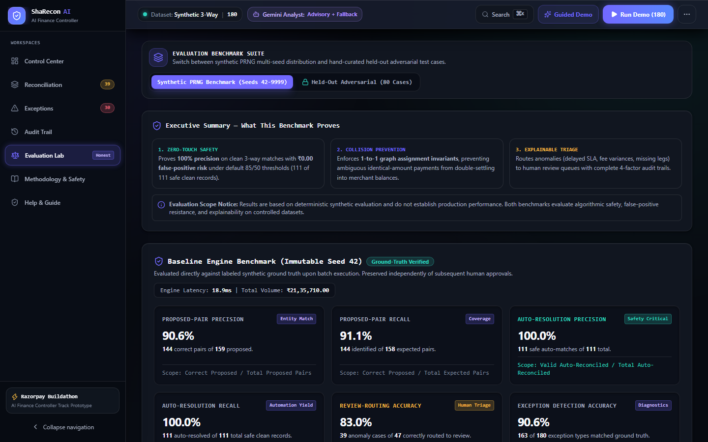
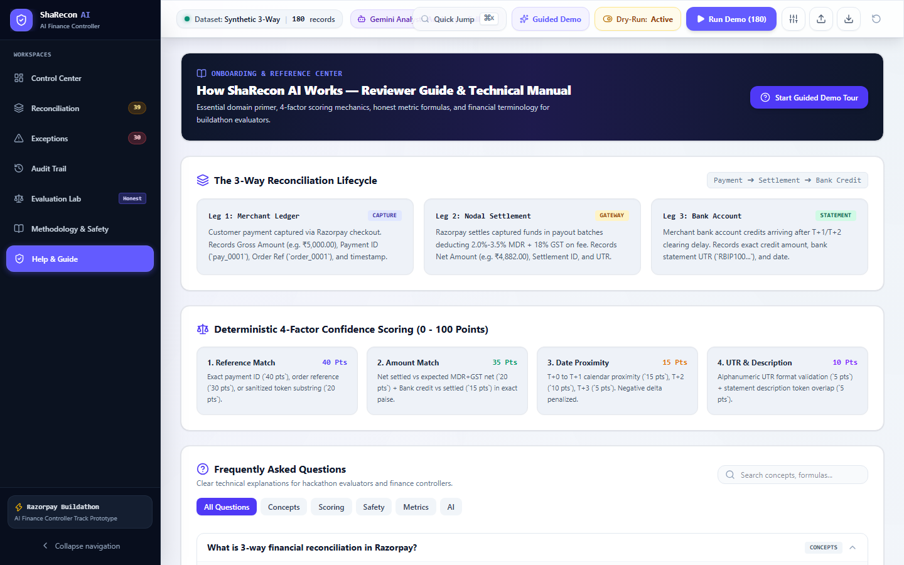
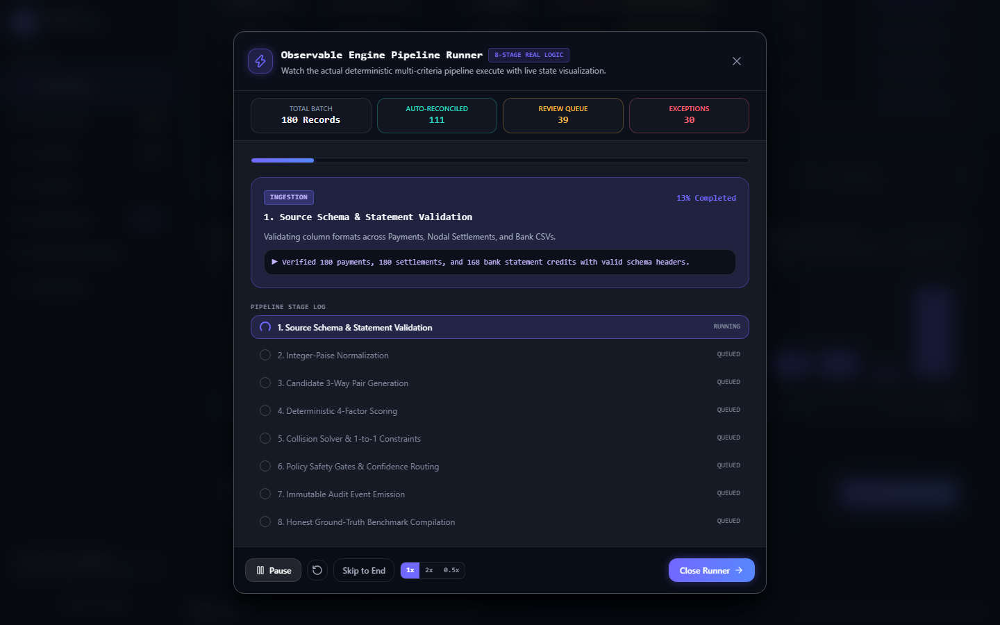
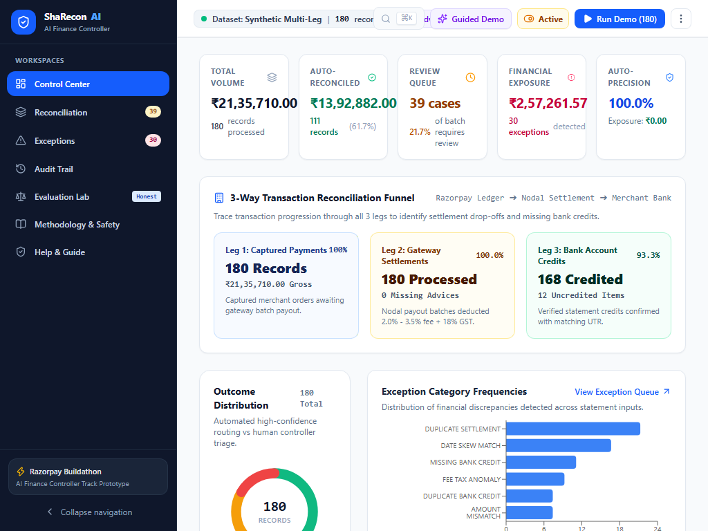
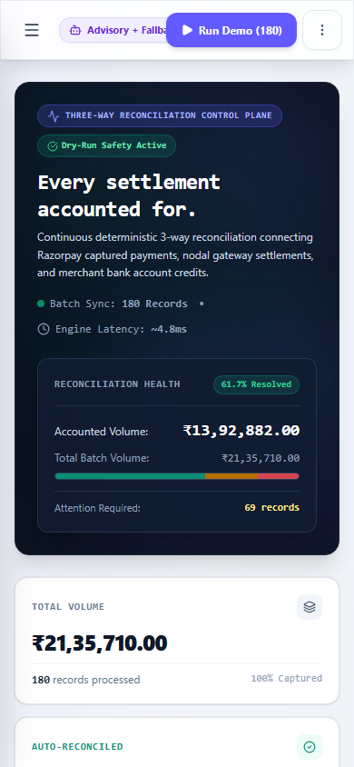

# ShaRecon AI

> **Explainable reconciliation. Confident financial control.**  
> *Built for the Razorpay AI Buildathon (Track: AI Finance Controller)*

[](https://github.com/skmdshariff143-ai/sharecon-ai)
[](https://github.com/skmdshariff143-ai/sharecon-ai)
[](https://github.com/skmdshariff143-ai/sharecon-ai)
[](https://sharecon-ai.vercel.app)
[](https://sharecon-ai.vercel.app)

Production URL: **[https://sharecon-ai.vercel.app](https://sharecon-ai.vercel.app)**  
GitHub Repository: **[https://github.com/skmdshariff143-ai/sharecon-ai](https://github.com/skmdshariff143-ai/sharecon-ai)**

---

## 🌟 Executive Summary

Merchants operating at scale face daily reconciliation friction connecting customer payments captured in Razorpay, nodal gateway settlement batches, and merchant bank account credits. References are frequently truncated, dates diverge due to banking holidays or cutoffs, amounts reflect fee tiers (2.0% to 3.5%) and 18% GST deductions, and deposits may be delayed, duplicated, or missing.

**ShaRecon AI** is a financial reconciliation operations control center built for the Razorpay AI Buildathon. It reconciles multi-leg transaction streams with **strict integer-paise arithmetic**, a **deterministic 4-factor scoring engine**, **1-to-1 collision prevention safeguards**, an **8-stage observable live runner**, and a **grounded Gemini 2.5 Flash exception analyst** backed by an offline deterministic rule-based fallback.

---

## 🏛️ System Architecture

```mermaid
graph TD
    A[Synthetic Data Generator / CSV Upload] --> B[Normalization & Schema Validation in Integer Paise]
    B --> C[Deterministic 3-Way Candidate Matcher]
    C --> D[Candidate Match Explorer & 1-to-1 Constraint Solver]
    D --> E{Confidence Scoring & Safety Circuit Breaker}
    E -->|Score >= 85% & Safe Type| F[Auto-Reconciled Safe Matches]
    E -->|Score 50-84% or Discrepancy| G[Human Review Queue & Contextual Copilot]
    E -->|Score < 50% or Incomplete Leg| H[Unmatched Exception Queue & Gemini Advisory]
    G & H --> I[Grounded Gemini Exception Analyst / Deterministic Fallback]
    G --> J[Reviewer Action: Approve / Reject / Flag]
    F & J & H --> K[Append-Only Audit Trail]
    D --> L[Ground Truth Benchmark Evaluator (Immutable)]
    L --> M[Honest Metrics: Pair Precision, Auto-Precision, Routing & Exposure]
    L --> N[5-Policy Comparative Matrix & Multi-Seed Simulator]
```

---

## ✨ Key Capabilities

### 1. Integer-Paise Financial Precision
- Eliminates floating-point rounding errors by enforcing `1 INR = 100 paise` across all ledger calculations, fee deductions, and delta comparisons.

### 2. Explainable Deterministic Matching
- **4-Factor Evidence Breakdown**:
  - **Reference Match (40 pts)**: Exact payment ID, order ID, or partial reference.
  - **Amount Compatibility (35 pts)**: Net settled amount vs expected net (`20 pts`) + Bank credit amount vs settled amount (`15 pts`).
  - **Date Window Proximity (15 pts)**: T+0 to T+3 calendar delta scoring.
  - **UTR & Description Similarity (10 pts)**: Alphanumeric UTR validation & token overlap.
- Every result produces a plain-English, traceable audit explanation (e.g., *"Matched with 98% confidence: Exact Payment ID ref (pay_0001_razor) verified. Net settled amount matches expected ₹4,899.00. Bank credit verified with exact UTR RBIP100000073. Settled in 1 day."*).

### 3. Observable 8-Stage Live Reconciliation Runner
- Watch the engine execute in slow motion through 8 distinct deterministic pipeline phases:
  1. Source Schema & Statement Validation
  2. Currency & Integer-Paise Normalization
  3. Reference Key Indexing (Exact & Partial)
  4. 4-Factor Candidate Matrix Scoring
  5. 1-to-1 Constraint & Collision Resolution
  6. Confidence Routing & Circuit Breakers
  7. Automated Reconciliation & Queue Tagging
  8. Immutable Audit Trail Commit

### 4. Grounded Gemini Exception Analyst & Advisory Copilot
- Gemini 2.5 Flash operates strictly as an advisory exception copilot via a server-side route.
- Summarizes anomalies, classifies risk, and produces actionable checklists without ever altering numerical match scores or executing financial movement.
- Deterministic fallback preserves core exception triage when Gemini is unavailable, with explicit UI disclosure (`[ShaRecon-Deterministic-Fallback]`).

### 5. Financial Safety & Human-in-the-Loop Controls
- **Dry-Run by Default**: Simulates matching without committing live ledger state.
- **Safety Circuit Breaker**: Halts automated matching if the batch anomaly rate exceeds 35%.
- **Collision Protection**: Prevents duplicate settlements or bank credits from being double-assigned.
- **Immutable Baseline Benchmark**: Human reviewer approve/reject operations update live session counters but do not rewrite baseline engine benchmark metrics.

---

## 📸 Product Walkthrough & Responsive UI Screenshots

| Desktop Control Center (1440 × 900) | Evidence Drawer & Candidate Explorer (1440 × 900) |
| :---: | :---: |
|  |  |

| Evaluation Lab & 5-Policy Matrix (1440 × 900) | Help & Reviewer Onboarding Workspace (1440 × 900) |
| :---: | :---: |
|  |  |

| Observable 8-Stage Live Runner (1440 × 900) | Tablet Control Center (1024 × 768) | Mobile Control Center (390 × 844) |
| :---: | :---: | :---: |
|  |  |  |

---

## 📊 Dual-Track Honest Evaluation Benchmark

ShaRecon AI maintains two strictly separated benchmarks to prevent circular generator-matcher coupling:

1. **Synthetic Multi-Seed Benchmark**: Evaluated dynamically across Seeds 42, 101, 777, 2024, and 9999 (180 records each).
2. **Manually Curated Held-Out Adversarial Benchmark**: 80 hand-constructed failure scenarios testing reference truncation, amount collisions, duplicate UTRs, wrong narration references, and bank holiday delays, with independent ground-truth labels.

*Notice: Neither benchmark represents live production financial volume. Both evaluate algorithmic safety, false-positive resistance, and explainability on controlled datasets.*

### Track 1: Multi-Seed Benchmark Results (Synthetic PRNG)
*Committed artifact available at [`docs/generated/benchmark.md`](docs/generated/benchmark.md) and [`docs/METRIC_INTEGRITY_AUDIT.md`](docs/METRIC_INTEGRITY_AUDIT.md).*

| Seed | Records | Proposed-Pair Precision | Proposed-Pair Recall | Auto-Resolution Precision | Auto-Resolution Recall | Review-Routing Acc | Latency |
| :---: | :---: | :---: | :---: | :---: | :---: | :---: | :---: |
| **42** | 180 | 90.6% | 91.1% | 100.0% | 100.0% | 83.0% | ~4.8ms |
| **101** | 180 | 88.9% | 91.1% | 100.0% | 100.0% | 87.2% | ~4.6ms |
| **777** | 180 | 90.1% | 91.8% | 100.0% | 100.0% | 87.2% | ~4.9ms |
| **2024** | 180 | 91.7% | 90.5% | 100.0% | 100.0% | 78.7% | ~4.7ms |
| **9999** | 180 | 91.4% | 94.3% | 100.0% | 100.0% | 80.9% | ~4.8ms |

### Track 2: Held-Out Adversarial Benchmark Results (80 Curated Cases)
*Committed report: [`docs/evaluation/HELD_OUT_REPORT.md`](docs/evaluation/HELD_OUT_REPORT.md) | Records: [`docs/evaluation/held-out-records.json`](docs/evaluation/held-out-records.json) | Ground Truth: [`docs/evaluation/held-out-ground-truth.json`](docs/evaluation/held-out-ground-truth.json)*

| Metric Category | Result | Target | Description |
| :--- | :---: | :---: | :--- |
| **Proposed-Pair Precision** | **97.1%** | $\ge 85.0\%$ | 68 of 70 proposed settlement/bank links correct |
| **Proposed-Pair Recall** | **97.1%** | $\ge 85.0\%$ | 68 of 70 true financial links identified |
| **Auto-Resolution Precision** | **83.3%** | Un-Tuned Baseline | Reported honestly; 7 unsafe matches isolated in Error Inspector |
| **Auto-Resolution Recall** | **100.0%** | $\ge 70.0\%$ | 35 of 35 clean ground-truth records safely auto-cleared |
| **Review-Routing Accuracy** | **75.9%** | $\ge 70.0\%$ | 22 of 29 anomaly cases routed to manual review queue |
| **Exception Accuracy** | **91.3%** | $\ge 85.0\%$ | 73 of 80 exception types matched ground truth |
| **False-Positive Exposure** | **₹28,100.00** | Documented | 7 items documented in detail with factor scores |

---

## 🔥 What Broke, and How Did We Get Out?

> *Full technical case study with 4 submission formats: [`docs/WHAT_BROKE.md`](docs/WHAT_BROKE.md) | Audit Report: [`docs/METRIC_INTEGRITY_AUDIT.md`](docs/METRIC_INTEGRITY_AUDIT.md)*

### The Incident
During evaluation testing, our immutable baseline on Seed 42 reported **111 auto-reconciled records** with **100.0% precision** and **₹0.00 false-positive exposure**. However, when running the interactive Policy Simulator at the exact same 85/50 thresholds, the simulator reported **118 auto-reconciled records**, **92.4% precision**, and **₹1,42,445.00 in false-positive risk**.

### The Root Cause: A Blinded Collision Graph
Tracing the data flow revealed that `page.tsx` was only passing matched output records to the evaluation tab. The simulator was reverse-engineering statement inputs using `records.map(r => r.matchedBankTransaction)`, inadvertently **stripping 9 uncredited bank transactions and distractor collision entries**. Without distractors in the input feed, the 1-to-1 collision-prevention graph had no competing records to detect ambiguity against, allowing 7 high-risk payments to falsely auto-clear.

### The Remediation
1. **Raw Triad State Preservation**: Preserved the complete `{ payments, settlements, bankTransactions }` triad in state and passed them directly to evaluation tools.
2. **Canonical Pipeline Unification**: Enforced the single evaluation pipeline: $\text{Raw Statements} \rightarrow \text{reconcileBatch}() \rightarrow \text{evaluateReconciliation}()$.
3. **Scorer Hardening**: Updated `scorer.ts` to strictly enforce bank amount differences (`bankDiff > feeTolerancePaise` caps confidence at $\le 75\%$ and routes to human review).
4. **Adversarial Regression Suite**: Added 12 adversarial unit tests (`integrity.test.ts`) guaranteeing exact 111-record baseline-to-simulation parity.

---

## 🛠️ Verification & Quality Gates

Run all automated checks locally:

```bash
# 1. ESLint (0 errors, 0 warnings)
npm run lint

# 2. TypeScript Strict Type Check (0 errors)
npm run type-check

# 3. Vitest Unit, Adversarial & Held-Out Suite (48 unit tests)
npm run test

# 4. Canonical Benchmark Artifact Generator
npm run generate:benchmark

# 5. Held-Out Adversarial Artifact Generator
npm run generate:heldout

# 6. Production Turbopack Build
npm run build

# 7. Playwright End-to-End Suite (36 E2E checks)
npm run test:e2e
```

---

## 🔒 Safety & Buildathon Disclosures

- **Zero Live Money Movement**: This application does not initiate bank transfers, payout calls, or ledger mutations.
- **Simulated Synthetic Datasets**: All transactions, accounts, and UTRs are deterministically generated synthetic mock records.
- **Evaluated System**: Evaluated for algorithmic accuracy, financial safety controls, and explainable audit trails for the Razorpay AI Buildathon.
