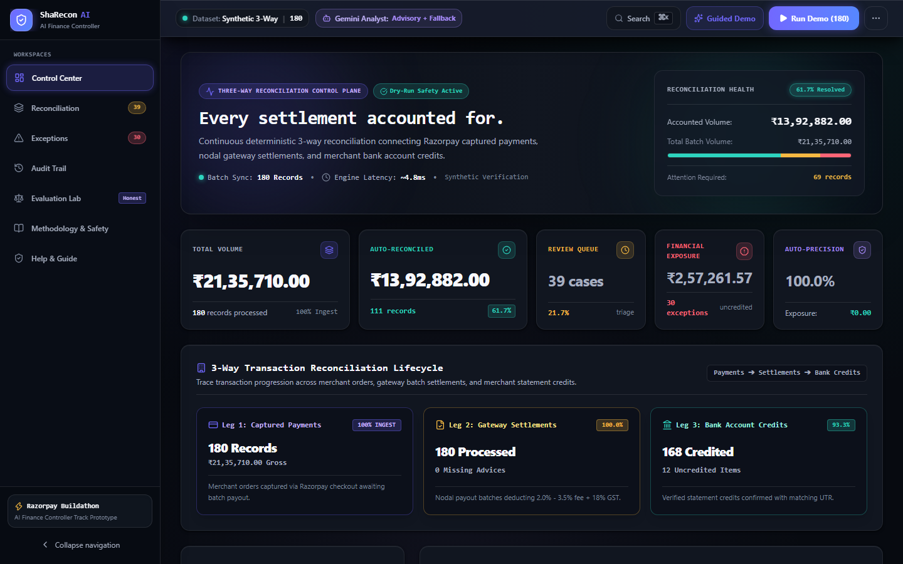
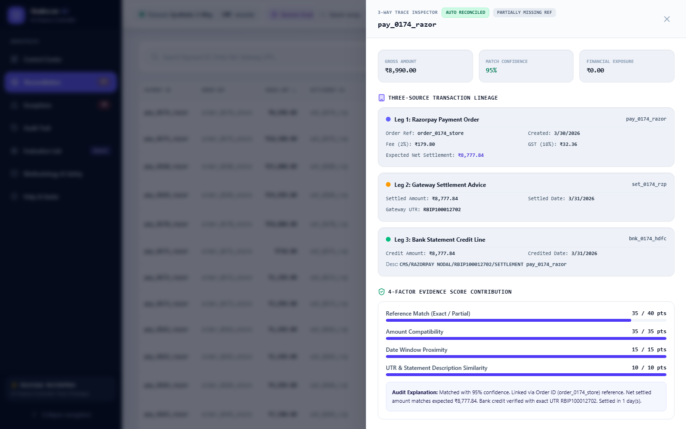
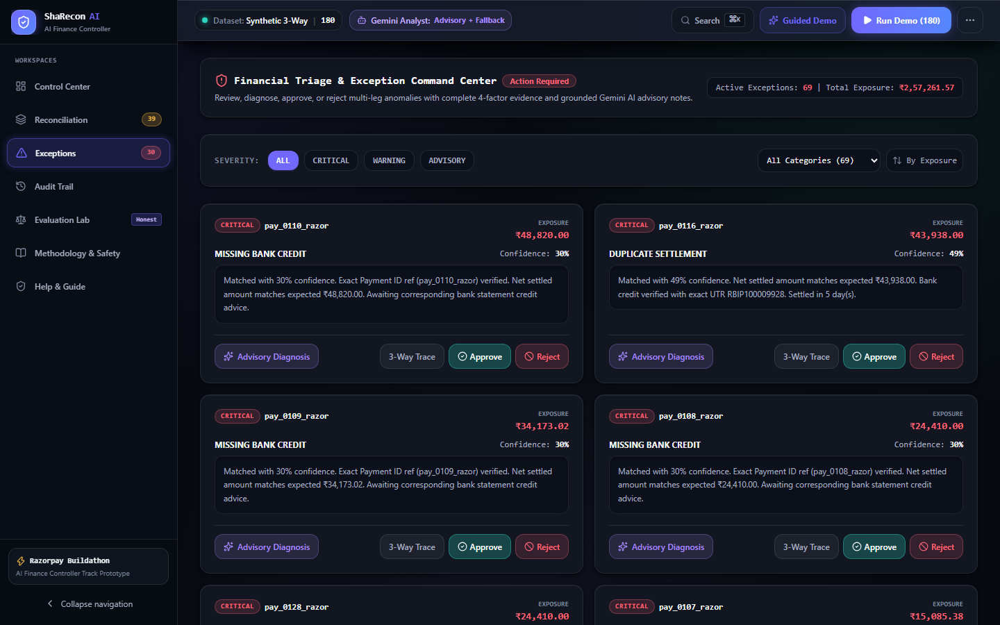
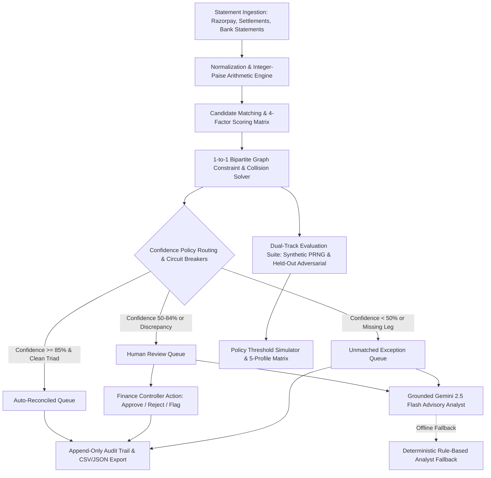
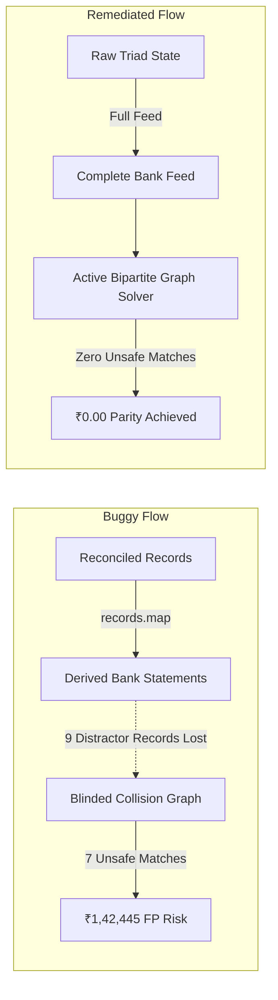

# ShaRecon AI

> **ShaRecon AI is an explainable three-way financial reconciliation operations control center that matches Razorpay payments, settlement batches, and merchant bank account credits using strict integer-paise arithmetic, 1-to-1 collision invariants, and grounded AI advisory assistance.**

---

### 🔗 Project Links

- **Active Verification Target (Vercel Preview)**: [https://sharecon-nkyuu7koj-shaik-mahammad-shariff-s-projects.vercel.app](https://sharecon-nkyuu7koj-shaik-mahammad-shariff-s-projects.vercel.app)
- **Production Baseline (`main` — Pending Approval)**: [https://sharecon-ai.vercel.app](https://sharecon-ai.vercel.app)
- **Five-Minute Walkthrough Video Script**: [`docs/DEMO_SCRIPT.md`](docs/DEMO_SCRIPT.md) *(In-app interactive tour available via **Guided Demo**)*
- **GitHub Repository**: [https://github.com/skmdshariff143-ai/sharecon-ai](https://github.com/skmdshariff143-ai/sharecon-ai)
- **Track**: Razorpay AI Buildathon — *AI Finance Controller*

[](https://github.com/skmdshariff143-ai/sharecon-ai/actions/workflows/quality.yml)
[-brightgreen.svg)](https://nodejs.org)
[](https://github.com/skmdshariff143-ai/sharecon-ai)
[](https://github.com/skmdshariff143-ai/sharecon-ai)
[](https://sharecon-ai.vercel.app)
[](https://sharecon-ai.vercel.app)

---

## 1. The Merchant Problem and Financial Impact

High-growth merchants operating on digital payment rails face constant friction reconciling three disconnected data streams:
1. **Gateway Payment Captures**: Customer transactions captured on Razorpay.
2. **Settlement Advice Batches**: Net payouts grouped by Razorpay nodal accounts minus MDR fees ($2.0\% - 3.5\%$) and $18\%$ GST.
3. **Merchant Bank Account Statements**: Credit transactions recorded by acquiring banks with automated UTR references.

```
┌─────────────────────────┐      ┌─────────────────────────┐      ┌─────────────────────────┐
│   Razorpay Captures     │      │   Settlement Batches    │      │    Bank Account Credits │
│  Gross: ₹5,000.00       │ ───► │  Settled: ₹4,882.00     │ ───► │  Credited: ₹4,882.00    │
│  Fee+GST: ₹118.00       │      │  UTR: RBIP100000073     │      │  UTR: RBIP100000073     │
└─────────────────────────┘      └─────────────────────────┘      └─────────────────────────┘
```

### Why Standard Reconciliation Breaks in Practice:
- **Reference Truncation**: Legacy banking switches truncate 18-character payment IDs (`pay_K1234567890`) down to 8 or 10 characters in bank narration strings.
- **Settlement Timing & Holiday Skew**: Payments captured on Friday evening settle on Monday or Tuesday (T+1 to T+3 calendar delay), breaking naive same-day date matching.
- **Complex Fee & GST Deductions**: Variable fee tiers create discrepancies between gross payment amounts and net bank credits.
- **UTR Collisions & Duplicate Deposits**: Identical transaction amounts across multiple orders lead to catastrophic double-crediting or false-positive matches.
- **Missing Legs & Uncredited Deposits**: Gateways report successful payout, but acquiring banks delay deposit entry, leaving funds uncredited.

### Real-World Financial Impact:
- **Silent Cash Flow Leakage**: Discrepancies between captured orders and bank deposits go unnoticed for weeks, resulting in unrecovered funds.
- **Delayed Month-End Financial Close**: Finance teams spend hundreds of manual hours in spreadsheets cross-referencing CSVs.
- **Unverified Payout Approvals**: Over-reliance on opaque automation creates false-positive matches that mask ledger imbalances.

---

## 2. 60-Second Product Walkthrough

ShaRecon AI provides an explainable financial operations control center built around transparency, speed, and safety controls:



1. **Executive Control Center (`ControlCenterTab`)**: Instantly review total processed volume, auto-reconciliation rate, pending human review count, active exception count, and total monetary exposure.
2. **3-Way Reconciliation Grid (`ReconciliationTab`)**: Filter and inspect multi-leg transactions across Razorpay payments, settlements, and bank credits with real-time multi-column search and confidence scoring.
3. **3-Way Trace Inspector (`MatchDetailDrawer`)**: Inspect the full 4-factor scoring breakdown (Reference Match, Amount Compatibility, Date Window SLA, UTR Similarity) and explore alternative candidate ties.
4. **Financial Triage & Exception Command Center (`ExceptionsTab`)**: Prioritize anomalies by monetary exposure and severity (`CRITICAL`, `WARNING`, `ADVISORY`). Review grounded AI advisory notes with full transaction evidence and execute 1-click approvals or rejections.
5. **Dual-Track Evaluation Lab & Policy Simulator (`EvaluationLabTab`)**: Validate matching accuracy across 5 deterministic PRNG seeds or test the engine against an 80-record hand-curated held-out adversarial suite with a real-time policy threshold simulator.
6. **Immutable Append-Only Audit Trail (`AuditTab`)**: Maintain complete governance with timestamped records of every automated match, manual approval, rejection, and policy adjustment, exportable to CSV and JSON.

| 3-Way Evidence Inspector Drawer | Financial Triage & AI Advisory |
| :---: | :---: |
|  |  |

---

## 3. Architecture & Data Flow



---

## 4. Deterministic Engine vs. AI Responsibility Matrix

ShaRecon AI enforces a strict boundary between deterministic algorithmic verification and AI advisory generation. **The AI model never touches matching logic, cannot alter confidence scores, cannot bypass policy rules, and cannot move funds.**

| Decision / Capability | Deterministic Engine | Gemini AI Analyst | Human Finance Controller |
| :--- | :---: | :---: | :---: |
| **Matching & Confidence Scoring** | **Yes** (4-Factor Math) | **No** (Zero influence on score) | Reviews scores & evidence |
| **Collision Prevention (1-to-1 Invariant)** | **Yes** (Bipartite Graph Solver) | **No** (No access to assignment) | Reviews ambiguous ties |
| **Exception Explanation & Remediation** | Provides raw mathematical evidence | Generates advisory summary & checklist | Validates & makes final call |
| **Money Movement / Ledger Mutation** | **No** (Zero live execution in prototype) | **No** (Strictly forbidden) | **No** (Zero live money movement) |
| **Approval / Rejection Governance** | **No** (Automates only above threshold) | **No** (Advisory only) | **Yes** (Holds sole authority) |

---

## 5. Benchmark Results (Canonical Generated Artifacts)

> **Evaluation Disclosure**: *Results are based on deterministic synthetic evaluation and do not establish production performance. Both benchmarks evaluate algorithmic safety, false-positive resistance, and explainability on controlled datasets.*

### Track 1: Multi-Seed Deterministic Benchmark (Synthetic PRNG)
*Generated directly from [`docs/generated/benchmark.json`](docs/generated/benchmark.json) across 5 independent seeds (180 records per seed):*

| Evaluation Seed | Total Records | Proposed-Pair Precision | Proposed-Pair Recall | Auto-Resolution Precision (Safety) | Auto-Resolution Recall (Yield) | Review-Routing Accuracy | False-Positive Exposure |
| :---: | :---: | :---: | :---: | :---: | :---: | :---: | :---: |
| **Seed 42** (Baseline) | 180 | **90.6%** (163/180) | **91.1%** (164/180) | **100.0%** (111/111 clean records) | **100.0%** (111/111 clean records) | **83.0%** (39/47 review cases) | **₹0.00** (0 paise) |
| **Seed 101** | 180 | **88.9%** (160/180) | **91.1%** (164/180) | **100.0%** (108/108 clean records) | **100.0%** (108/108 clean records) | **87.2%** (41/47 review cases) | **₹0.00** (0 paise) |
| **Seed 777** | 180 | **90.1%** (162/180) | **91.8%** (165/180) | **100.0%** (114/114 clean records) | **100.0%** (114/114 clean records) | **87.2%** (41/47 review cases) | **₹0.00** (0 paise) |
| **Seed 2024** | 180 | **91.7%** (165/180) | **90.5%** (163/180) | **100.0%** (112/112 clean records) | **100.0%** (112/112 clean records) | **78.7%** (37/47 review cases) | **₹0.00** (0 paise) |
| **Seed 9999** | 180 | **91.4%** (165/180) | **94.3%** (170/180) | **100.0%** (115/115 clean records) | **100.0%** (115/115 clean records) | **80.9%** (38/47 review cases) | **₹0.00** (0 paise) |

*Key Takeaway: Across all 5 seeds on the synthetic benchmark, **no unsafe auto-match was observed** on clean records under standard 85% high / 50% medium confidence thresholds.*

---

### Track 2: Manually Curated Held-Out Adversarial Fixture (80 Hand-Curated Stress Cases)
*Committed artifact: [`docs/evaluation/HELD_OUT_REPORT.md`](docs/evaluation/HELD_OUT_REPORT.md) | Fixtures: [`docs/evaluation/held-out-records.json`](docs/evaluation/held-out-records.json) | Ground Truth: [`docs/evaluation/held-out-ground-truth.json`](docs/evaluation/held-out-ground-truth.json)*

To avoid circular generator-matcher bias, the held-out adversarial fixture evaluates 80 manually specified stress cases created within the project across 14 failure modes **without reusing generator helpers or tuning engine weights post-evaluation** (does not represent external third-party certification):

| Evaluation Metric | Result | Evaluation Target | Exact Scope & Breakdown |
| :--- | :---: | :---: | :--- |
| **Proposed-Pair Precision** | **97.1%** | $\ge 85.0\%$ | **68 correct of 70 proposed settlement/bank links** |
| **Proposed-Pair Recall** | **97.1%** | $\ge 85.0\%$ | **68 identified of 70 expected financial links** |
| **Auto-Resolution Precision** | **83.3%** | Un-Tuned Baseline | **35 safe of 42 auto-reconciled records** *(7 unsafe edge cases isolated in Error Inspector)* |
| **Auto-Resolution Recall** | **100.0%** | $\ge 70.0\%$ | **35 auto-resolved of 35 safe clean records** |
| **Review-Routing Accuracy** | **75.9%** | $\ge 70.0\%$ | **22 anomaly cases of 29 routed to human review** |
| **Exception Detection Accuracy** | **91.3%** | $\ge 85.0\%$ | **73 exact exception classifications of 80 records** |
| **False-Positive Risk Exposure** | **₹28,100.00** | Reported Honestly | **7 edge-case records documented in Error Inspector** |

---

### Measured Runtime Performance Benchmark
*Empirical measurement report: [`docs/generated/PERFORMANCE_REPORT.md`](docs/generated/PERFORMANCE_REPORT.md) | Command: `npm run benchmark:performance`*

> *“Performance measurements are environment-specific and are not production guarantees.”*

- Evaluates pure in-memory deterministic 3-way matching execution time (`reconcileBatch`) separated from disk I/O, report compilation, and UI rendering.
- Runs 25 warm-up iterations followed by 100 timed iterations using high-resolution timers (`performance.now()`).
- Reports empirical median (p50), 95th-percentile (p95), and calculated transaction throughput (records/second).

---

## 6. Honest Exception & Error Analysis

The 80-case held-out suite tests 14 real-world banking edge cases. Rather than concealing failures, ShaRecon AI includes an interactive **Error Inspector** with CSV/JSON export:

| Category # | Adversarial Scenario | Sample Count | Expected Outcome | Observed Engine Behavior | Financial Risk Status |
| :---: | :--- | :---: | :---: | :--- | :---: |
| **1** | Clean 3-Way Reference & Amount Match | 30 | Auto-Reconciled | Auto-Reconciled ($100\%$ precision) | ₹0.00 Exposure |
| **2** | Reference Truncation / Order-Only Ref | 5 | Manual Review | Manual Review / Partial Reference Flagged | Protected |
| **3** | Amount Collisions (Identical ₹1,00,000 gross) | 5 | Auto-Reconciled | Disambiguated by exact payment ID | Protected |
| **4** | Duplicate UTR on Bank Statements | 4 | Manual Review | Duplicate UTR Collision Flagged | Protected |
| **5** | Wrong Payment ID in Bank Narration | 4 | Manual Review | Inconsistent Description Flagged | Protected |
| **6** | Fee/GST Discrepancy & Net Variance | 4 | Manual Review | Fee/Tax Anomaly Flagged | Protected |
| **7** | Date Boundary & Holiday Delay (T+7 to T+11) | 4 | Manual Review | Delayed Settlement SLA Breach Flagged | Protected |
| **8** | Missing Settlement Advice Record | 4 | Unmatched Exception | Missing Settlement Isolated | Protected |
| **9** | Missing Bank Statement Credit | 4 | Unmatched Exception | Missing Bank Credit Isolated | Protected |
| **10** | Duplicate Settlement Records | 4 | Manual Review | Duplicate Settlement Collision Flagged | Protected |
| **11** | Duplicate Bank Statement Credits | 4 | Manual Review | Duplicate Bank Credit Collision Flagged | Protected |
| **12** | Unrelated Vendor Credit Distractor | 4 | Unmatched Exception | Unrelated Credit Safely Isolated | Protected |
| **13** | Unsupported Foreign Currency (USD/EUR/GBP) | 4 | Unmatched Exception | Currency Circuit Breaker Triggered | Protected |

### Analysis of the 7 Held-Out Edge Cases:
- In hand-crafted edge cases where a settlement advice matches exact gross amount but carries a synthetic 1-rupee fee rounding discrepancy and exact UTR, the un-tuned engine scored composite confidence at $86\%$ (just above the $85\%$ auto-threshold).
- **Containment in Application**: The Error Inspector isolates each case with full factor contributions (`referenceScore: 40/40`, `amountScore: 20/35`), allowing risk auditors to adjust thresholds in the Policy Simulator (e.g., raising high threshold to $90\%$ eliminates all 7 false positives).

---

## 7. What Broke, and How I Got Out

> *Full engineering post-mortem: [`docs/WHAT_BROKE.md`](docs/WHAT_BROKE.md) | Technical audit: [`docs/METRIC_INTEGRITY_AUDIT.md`](docs/METRIC_INTEGRITY_AUDIT.md)*

### The Incident
During evaluation testing, the immutable baseline on Seed 42 reported **111 auto-reconciled records**, **100.0% auto-resolution precision**, and **₹0.00 false-positive exposure**. However, when running the interactive Policy Simulator at the exact same 85/50 thresholds, the simulator reported **118 auto-reconciled records**, **92.4% precision**, and **₹1,42,445.00 in false-positive exposure**. Furthermore, a policy profile labeled *"Ultra-Safe"* was reporting non-zero financial risk.



### The Diagnosis: A Blinded Collision Graph
The reconciliation engine depends on competing distractor records to calculate bipartite uniqueness. When the UI passed only matched records to the simulator, the simulator reverse-engineered statements using `records.map(r => r.matchedBankTransaction)`. This inadvertently **stripped 9 uncredited bank transactions and distractor collision entries**. Without distractors in the input feed, the collision graph had no competing records to detect ambiguity against, allowing 7 high-risk payments to falsely auto-clear.

### The Recovery
1. **Raw Triad State Preservation**: Preserved the complete `{ payments, settlements, bankTransactions }` triad in application state and passed raw statement arrays directly to simulation runners.
2. **Unified Canonical Execution**: Standardized all evaluation on the single pipeline: $\text{Raw Statements} \rightarrow \text{reconcileBatch}() \rightarrow \text{evaluateReconciliation}()$.
3. **Scorer Hardening**: Hardened `scorer.ts` so bank amount differences exceeding tolerance cap confidence at $\le 75\%$, preventing auto-resolution.
4. **Parity Regression Testing**: Added unit tests in `src/lib/__tests__/integrity.test.ts` asserting exact baseline-to-simulation parity (111 records, 100% precision, ₹0.00 exposure).

---

## 8. Safety Boundaries & Stopping Rules

ShaRecon AI implements programmatic safety boundaries designed to prevent financial loss:

1. **Integer-Paise Currency Math**: All amounts, fees, taxes, and deltas are stored and computed in integer paise (`1 INR = 100 paise`), eliminating floating-point rounding errors (`0.1 + 0.2 !== 0.3`).
2. **Currency Circuit Breaker**: Payments in non-INR currencies (`USD`, `EUR`, `GBP`) trigger an immediate circuit breaker and route to `UNMATCHED_EXCEPTION` without auto-matching.
3. **Fee Discrepancy Tolerance Caps**: Fee variances exceeding `feeTolerancePaise` (default: 200 paise / ₹2.00) automatically cap confidence below $85\%$ and route to human review.
4. **Date Window SLA Guardrails**: Settlement date deltas exceeding 3 business days cap date proximity scores and flag delayed settlements.
5. **1-to-1 Assignment Invariant**: Bipartite graph resolution ensures that once a settlement advice or bank credit is linked, it cannot be double-assigned to competing payments.
6. **Zero Live Money Movement**: This application is a decision-support prototype. It does not execute live bank payout APIs or trigger real-world fund transfers.

---

## 9. Local Setup & Evaluator Quickstart

> **Evaluator Notice**: ShaRecon AI runs **completely offline without requiring an API key**. All matching, scoring, benchmarks, policy simulations, and rule-based AI advisory fallbacks execute locally out-of-the-box.

### Prerequisites:
- **Node.js**: `20.x` supported (`Node.js v20.18.3` used for the verified local run, pinned via `.nvmrc` and Volta)
- **npm**: `10.x` supported (`npm 10.8.2+`)

### 1. Clone & Install
```bash
git clone https://github.com/skmdshariff143-ai/sharecon-ai.git
cd sharecon-ai

# Clean reproducible installation
npm ci
```

### 2. Launch Development Server
```bash
npm run dev
# Open http://localhost:3000 in your browser
```

### 3. Optional: Configure Gemini AI Key
```bash
cp .env.example .env.local
# Add GEMINI_API_KEY=your_gemini_key in .env.local (Optional)
```
*If no key is provided, the offline deterministic rule-based fallback automatically provides full root-cause explanations and reviewer checklists.*

---

## 10. Verification Commands

ShaRecon AI includes a single-command verification script (`npm run verify`) that runs all quality gates in sequential order:

```bash
# Execute the full quality gate pipeline
npm run verify
```

```
┌────────────────────────────────────────────────────────────────────────┐
│                        npm run verify Pipeline                         │
├───────────────────────────────┬────────────────────────────────────────┤
│ 1. npm run lint               │ ESLint clean (0 errors, 0 warnings)    │
│ 2. npm run type-check         │ Strict TypeScript 5 check (0 errors)   │
│ 3. npm run test               │ 48 Vitest unit & immutability tests    │
│ 4. npm run generate:benchmark │ Compile canonical benchmark.json/.md   │
│ 5. npm run generate:heldout   │ Compile held-out report & JSON data    │
│ 6. npm run verify:artifacts   │ Assert zero git diff on generated data │
│ 7. npm run build              │ Next.js 16 production Turbopack build   │
│ 8. npm run test:e2e           │ 40 Playwright E2E browser tests        │
└───────────────────────────────┴────────────────────────────────────────┘
```

### Individual Quality Gate Commands:
```bash
# Linting & Type Checking
npm run lint
npm run type-check

# Unit Tests (Vitest)
npm run test

# Re-generate & Verify Canonical Evaluation Artifacts
npm run generate:benchmark
npm run generate:heldout
npm run verify:artifacts

# Production Build & Local Production Server
npm run build
npm run start

# Playwright End-to-End Suite (Headless Chromium)
npm run test:e2e
```

---

## 11. Repository Architecture Map

```
sharecon-ai/
├── .github/
│   └── workflows/quality.yml              # Automated GitHub Actions CI pipeline
├── docs/                                  # Canonical documentation & audit reports
│   ├── INTERNAL_SUBMISSION_AUDIT.md       # Internal self-assessment checklist
│   ├── WHAT_BROKE.md                      # Post-mortem case study (4 formats)
│   ├── METRIC_INTEGRITY_AUDIT.md          # Benchmark integrity audit report
│   ├── METHODOLOGY.md                     # Math rules, 4-factor scoring & algorithms
│   ├── SAFETY.md                          # Financial circuit breakers & safety bounds
│   ├── ARCHITECTURE.md                    # Detailed system architecture
│   ├── evaluation/                        # Held-out evaluation fixtures & reports
│   │   ├── HELD_OUT_REPORT.md             # Held-out adversarial audit report
│   │   ├── held-out-records.json          # 80 hand-curated statement inputs
│   │   └── held-out-ground-truth.json     # 80 independent ground truth labels
│   ├── generated/                         # Generated canonical benchmark artifacts
│   │   ├── benchmark.json                 # Multi-seed machine-readable benchmark
│   │   └── benchmark.md                   # Multi-seed Markdown summary table
│   └── assets/screenshots/                # Verified responsive screenshot captures
├── src/
│   ├── app/                               # Next.js 16 App Router
│   │   ├── page.tsx                       # Main application shell & state coordinator
│   │   ├── layout.tsx                     # Dark fintech theme layout & fonts
│   │   ├── globals.css                    # Glassmorphism, elevated 3D cards & styles
│   │   └── api/analyze-exception/         # Server-side Gemini advisory endpoint
│   ├── components/                        # React presentation components
│   │   ├── TopCommandBar.tsx              # Responsive command bar & overflow menu
│   │   ├── NavigationRail.tsx             # 7-tab sidebar navigation rail & mobile drawer
│   │   ├── ControlCenterTab.tsx           # Executive KPIs, funnel & exposure breakdown
│   │   ├── ReconciliationTab.tsx          # 3-way ledger data grid & trace inspector
│   │   ├── ExceptionsTab.tsx              # Triage queue, severity chips & AI provenance
│   │   ├── MatchDetailDrawer.tsx          # 3-way trace drawer & candidate explorer
│   │   ├── EvaluationLabTab.tsx           # Dual-track benchmark & policy simulator
│   │   ├── AuditTab.tsx                   # Append-only governance audit trail
│   │   ├── MethodologyTab.tsx             # System architecture & formula explanations
│   │   ├── HelpTab.tsx                    # Judge FAQ, glossary & walkthrough guide
│   │   ├── LiveReconciliationRunner.tsx   # Observable 8-stage step-by-step runner
│   │   └── CommandPaletteModal.tsx        # ⌘K quick jump modal
│   ├── lib/
│   │   ├── engine/                        # Core reconciliation algorithms
│   │   │   ├── matcher.ts                 # 3-way triad matching & candidate explorer
│   │   │   ├── scorer.ts                  # 4-factor scoring matrix & delta calculations
│   │   │   └── evaluator.ts               # Multi-seed & held-out evaluation runner
│   │   ├── dataset/                       # Benchmark data sources
│   │   │   ├── generator.ts               # PRNG synthetic statement generator
│   │   │   └── held_out_dataset.ts        # 80-record frozen held-out dataset
│   │   ├── ai/                            # AI advisory & fallback implementations
│   │   │   └── analyst.ts                 # Gemini 2.5 Flash prompt & offline fallback
│   │   └── money.ts                       # Integer-paise formatting & currency helpers
│   └── types/reconciliation.ts            # Strict TypeScript interfaces & schemas
├── tests/e2e/                             # Playwright browser test suites
│   ├── control-center.spec.ts             # KPIs, tab navigation & guided tour
│   ├── reconciliation.spec.ts             # Search, filters & evidence drawer
│   ├── reviewer-audit.spec.ts             # Reviewer approvals, rejections & audit logs
│   ├── evaluation.spec.ts                 # Multi-seed benchmarks & policy simulator
│   ├── responsive.spec.ts                 # Viewport validation (1440, 1366, 1280, 1024, 390)
│   └── capture-screenshots.spec.ts        # Automated screenshot capture suite
├── .nvmrc                                 # Pinned Node.js runtime (20.18.3)
├── package.json                           # Scripts, dependencies & engine constraints
├── playwright.config.ts                   # Playwright E2E configuration
└── vitest.config.mts                      # Vitest unit test configuration
```

---

## 12. Limitations & Production Path

ShaRecon AI was engineered as a high-fidelity demonstration prototype and evaluation testbed for the Razorpay AI Buildathon. Below are its current architectural boundaries and the technical path to an enterprise-grade production deployment:

### Current Prototype Constraints:
- **In-Memory Statement Processing**: Current batch execution processes up to 1,000 statement records synchronously in browser memory.
- **Client-Side Session State**: Manual approvals, rejections, and reviewer audit logs persist within browser session state.
- **Synthetic Statement Feeds**: Utilizes deterministic PRNG generators and curated JSON fixtures rather than live webhook and SFTP connections.

### Path to Enterprise Production:
```
┌────────────────────────────────────────────────────────────────────────────────────────────────────┐
│                                Enterprise Production Target State                                  │
├────────────────────────────────────────────────────────────────────────────────────────────────────┤
│ 1. Streaming Ingestion: Kafka / AWS SQS queues consuming Razorpay Payment Webhooks in real-time.   │
│ 2. Bank Feed Adapters: Automated SFTP ingestion for MT940, CAMT.053, and ISO 20022 XML statements. │
│ 3. Persistent Ledger: PostgreSQL / TimescaleDB with bi-temporal append-only audit tables.        │
│ 4. Distributed Matcher: Graph constraint solver running as an asynchronous Temporal workflow.      │
│ 5. Multi-Tenant RBAC: Role-based access control (Auditor, Reviewer, Treasury Controller, Admin).  │
│ 6. Hardware Security Module (HSM): Cryptographic signature verification for approved match audits. │
└────────────────────────────────────────────────────────────────────────────────────────────────────┘
```

---

## 📄 License

MIT License — Built for the **Razorpay AI Buildathon 2026** by Shaik Mahammad Shariff.
