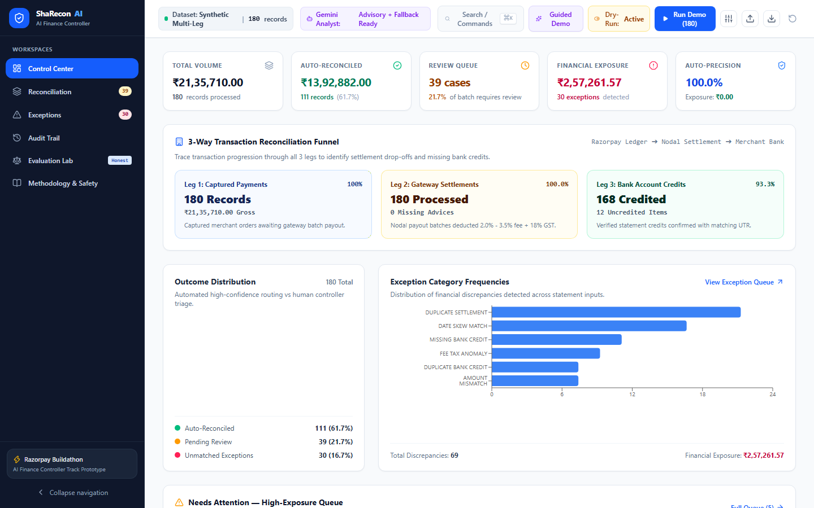
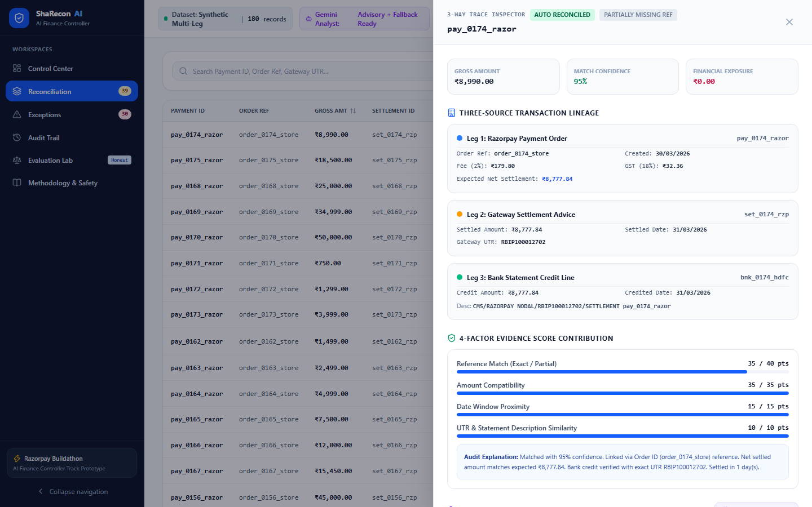
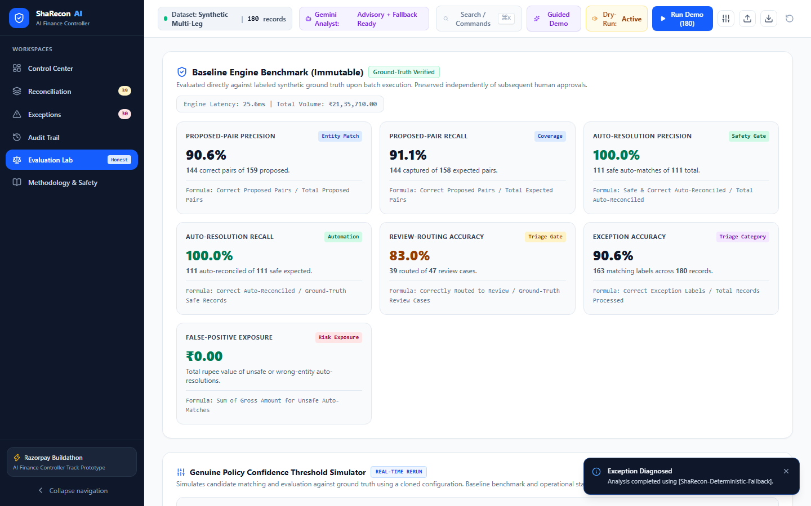
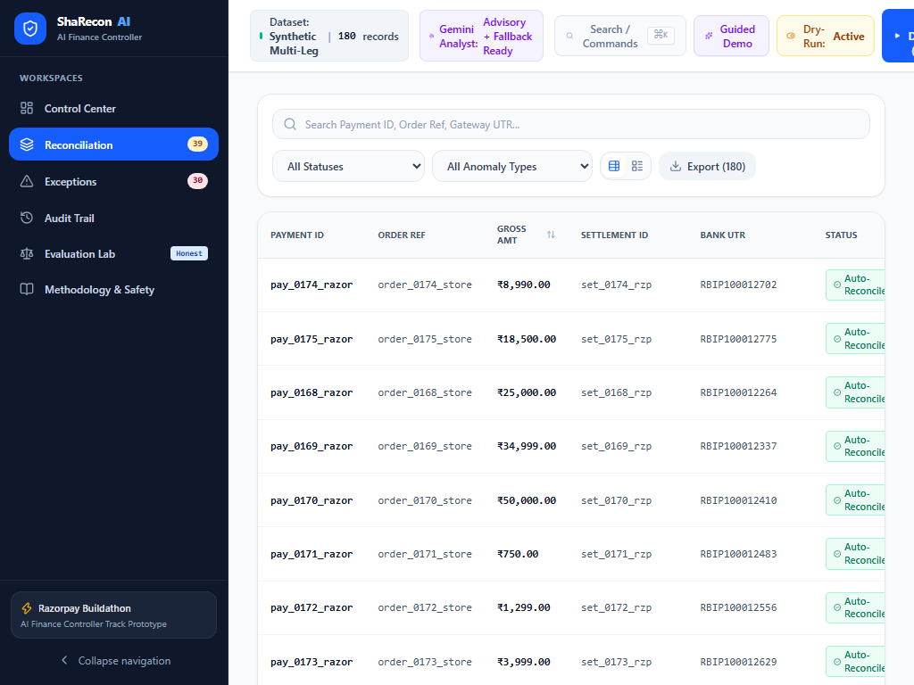
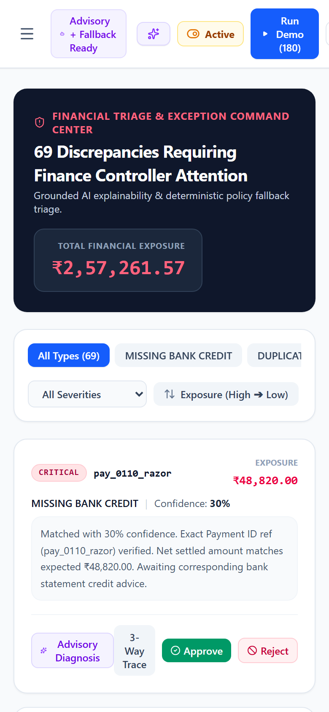

# ShaRecon AI

> **Explainable reconciliation. Confident financial control.**  
> *Built for the Razorpay AI Buildathon (Track: AI Finance Controller)*

---

## 🌟 Executive Summary

Merchants operating at scale face daily reconciliation friction connecting customer payments captured in Razorpay, nodal gateway settlement batches, and merchant bank account credits. References are frequently truncated, dates diverge due to banking holidays or cutoffs, amounts reflect fee tiers (2.0% to 3.5%) and 18% GST deductions, and deposits may be delayed, duplicated, or missing.

**ShaRecon AI** is a working financial reconciliation prototype and AI Finance Controller built for the Razorpay AI Buildathon. It processes multi-leg transaction streams with **strict integer-paise arithmetic**, a **deterministic 4-factor scoring engine**, **1-to-1 collision prevention safeguards**, and a **grounded Gemini 2.5 Flash exception analyst** supported by a deterministic offline fallback.

---

## 🏛️ System Architecture

```mermaid
graph TD
    A[Synthetic Data Generator / CSV Upload] --> B[Normalization & Schema Validation in Integer Paise]
    B --> C[Deterministic 3-Way Candidate Matcher]
    C --> D[Collision Prevention & 1-to-1 Constraint Solver]
    D --> E{Confidence Scoring & Safety Gates}
    E -->|Score >= 85% & Safe Type| F[Auto-Reconciled Safe Matches]
    E -->|Score 50-84% or Discrepancy| G[Human Review Queue]
    E -->|Score < 50% or Incomplete Leg| H[Unmatched Exception Queue]
    G & H --> I[Server-Side Grounded Gemini Analyst / Fallback]
    G --> J[Reviewer Action: Approve / Reject / Flag]
    F & J & H --> K[Append-Only Audit Trail]
    D --> L[Ground Truth Benchmark Evaluator (Immutable)]
    L --> M[Honest Metrics: Pair Precision, Auto-Precision, Routing & Exposure]
```

---

## ✨ Key Capabilities

### 1. Integer-Paise Financial Precision
- Eliminates floating-point rounding errors by enforcing `1 INR = 100 paise` across all ledger calculations, fee deductions, and delta comparisons.

### 2. Explainable Deterministic Matching
- **4-Factor Evidence Breakdown**:
  - **Reference Match (40 pts)**: Exact payment ID, order ID, or partial reference.
  - **Amount Compatibility (35 pts)**: Net settled amount vs expected net (`20 pts`) + Bank credit amount vs settled amount (`15 pts`).
  - **Date Window Proximity (15 pts)**: T+0 to T+3 calendar delta scoring.
  - **UTR & Description Similarity (10 pts)**: Alphanumeric UTR validation & token overlap.
- Every result produces a plain-English, traceable audit explanation (e.g., *"Matched with 98% confidence: Exact Payment ID ref (pay_0001_razor) verified. Net settled amount matches expected ₹4,899.00. Bank credit verified with exact UTR RBIP100000073. Settled in 1 day."*).

### 3. Grounded Gemini Exception Analyst with Deterministic Fallback
- Gemini 2.5 Flash operates strictly as an advisory exception copilot via a server-side route.
- It summarizes anomalies, classifies risk, and produces actionable checklists without ever altering numerical match scores or executing financial movement.
- Deterministic fallback preserves core exception triage when Gemini is unavailable, with explicit UI disclosure (`[ShaRecon-Deterministic-Fallback]`).

### 4. Financial Safety & Human-in-the-Loop Controls
- **Dry-Run by Default**: Simulates matching without committing live ledger state.
- **Safety Circuit Breaker**: Halts automated matching if the batch anomaly rate exceeds 35%.
- **Collision Protection**: Prevents duplicate settlements or bank credits from being double-assigned.
- **Immutable Baseline Benchmark**: Human reviewer approve/reject operations update live session counters but do not rewrite baseline engine benchmark metrics.

---

## 📸 Product Walkthrough & Responsive UI Screenshots

| Desktop Control Center (1440 × 900) | Evidence Drawer 3-Way Trace (1440 × 900) |
| :---: | :---: |
|  |  |

| Evaluation Lab & Simulator (1440 × 900) | Tablet Reconciliation Grid (1024 × 768) | Mobile Exception Center (390 × 844) |
| :---: | :---: | :---: |
|  |  |  |

---

## 📊 Honest Evaluation Benchmark & Multi-Seed Robustness

To ensure transparent evaluation, metrics are separated into distinct mathematical categories rather than grouped into a single ambiguous aggregate:

- **Proposed-Pair Precision**: Fraction of engine-proposed (Settlement + Bank) pairs where both IDs match ground truth.
- **Proposed-Pair Recall**: Fraction of ground-truth pairs correctly identified by the engine.
- **Auto-Resolution Precision**: Fraction of auto-reconciled records that are both ID-correct and safe to auto-resolve.
- **Auto-Resolution Recall**: Fraction of ground-truth safe records successfully auto-reconciled.
- **Review-Routing Accuracy**: Fraction of review-requiring records correctly routed to the human queue.
- **False-Positive Monetary Exposure**: Rupee value of unsafe or wrong-entity auto-resolutions (Target: ₹0.00).

### Multi-Seed Benchmark Results (180 Records per Seed)

| Seed | Proposed-Pair Precision | Proposed-Pair Recall | Auto-Resolution Precision | Auto-Resolution Recall | Review-Routing Accuracy | Exception Accuracy | Auto-Reconciliation Rate | False-Positive Exposure |
| :--- | :--- | :--- | :--- | :--- | :--- | :--- | :--- | :--- |
| **Seed 42** *(Default Demo)* | **90.6%** | **91.1%** | **100.0%** | **100.0%** | **83.0%** | **90.6%** | **61.7%** | **₹0.00** |
| **Seed 101** | **88.9%** | **91.1%** | **100.0%** | **100.0%** | **87.2%** | **90.6%** | **61.7%** | **₹0.00** |
| **Seed 777** | **90.1%** | **91.8%** | **100.0%** | **100.0%** | **87.2%** | **90.6%** | **61.7%** | **₹0.00** |
| **Seed 2024** | **91.7%** | **90.5%** | **100.0%** | **100.0%** | **78.7%** | **90.6%** | **61.7%** | **₹0.00** |
| **Seed 9999** | **91.4%** | **94.3%** | **100.0%** | **100.0%** | **80.9%** | **90.6%** | **61.7%** | **₹0.00** |

*Benchmark Note: Validated on five deterministic synthetic seeds. In this reported synthetic benchmark, no unsafe auto-match was observed (₹0.00 False-Positive Exposure). Results reflect deterministic synthetic evaluation and do not establish live production performance.*

---

## 🚀 Quick Start (Local Setup)

### Prerequisites
- Node.js 18+ (Tested on v24.16.0)
- npm 9+

### Installation
```bash
# 1. Clone the repository
git clone https://github.com/skmdshariff143-ai/sharecon-ai.git
cd sharecon-ai

# 2. Install dependencies
npm install

# 3. (Optional) Set your Gemini API key in .env.local
cp .env.example .env.local
# Edit .env.local: GEMINI_API_KEY=your_key_here

# 4. Run tests
npm run test

# 5. Run type checking & linting
npm run type-check
npm run lint

# 6. Start development server
npm run dev
```

Open [http://localhost:3000](http://localhost:3000) in your browser.

---

## ⚠️ Disclosures & Known Limitations

1. **Synthetic Data**: All transaction records, payment IDs, UTRs, and bank entries are synthetic simulations created for evaluation and testing purposes.
2. **No Real Money Movement**: The application is an analytical reconciliation controller and does not initiate banking transfers or modify live payment gateway balances.
3. **No Production Razorpay Connection**: Designed as a standalone buildathon prototype using synthetic data and CSV ingestion rather than live Razorpay OAuth endpoints.
4. **Session-Based State**: Reviewer decisions and uploaded batches reside in client session memory; production implementation would require a durable PostgreSQL/Ledger store.
5. **Gemini Advisory Role**: Gemini operates strictly as an advisory exception copilot and cannot approve matches, reject transactions, or alter deterministic scores.
