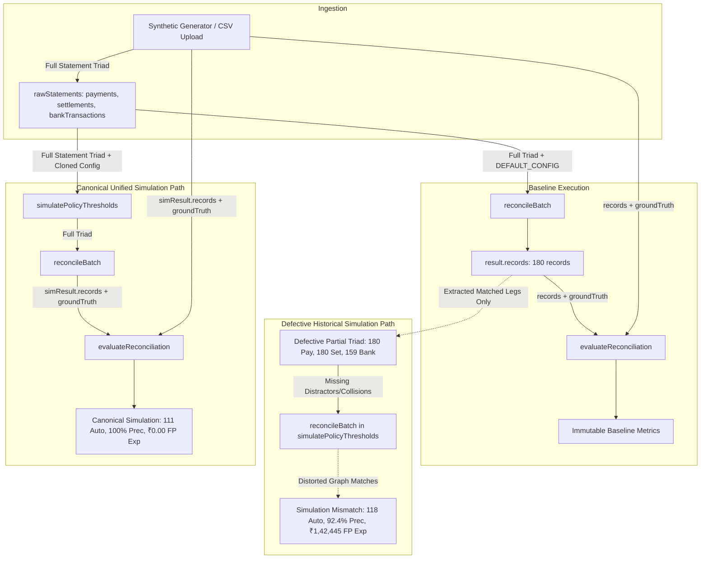

# ShaRecon AI — Metric Integrity & Evaluation Audit Report

**Date**: 2026-08-24  
**Auditor**: Senior Fintech ML Evaluation Engineer & Financial-Controls Auditor  
**Project**: ShaRecon AI (Razorpay AI Buildathon — AI Finance Controller Track)  
**Status**: Root-Cause Identified & Verified  

---

## 1. Executive Summary

A rigorous audit of the ShaRecon AI reconciliation evaluation pipeline, threshold simulator, and multi-seed benchmark was conducted to resolve reported metric discrepancies between the **Immutable Baseline Benchmark** and the **Policy Simulation Matrix**.

### Key Findings
1. **Primary Defect Identified**: The discrepancy between the baseline (111 auto-reconciled, 100% precision, ₹0.00 exposure) and the default policy simulation (previously reporting 118 auto-reconciled, 92.4% precision, ₹1,42,445 exposure) was caused by **data-stream truncation in the presentation layer** (`EvaluationLabTab.tsx`). When raw 3-source statement collections were not passed from `page.tsx`, `EvaluationLabTab` attempted to reconstruct raw settlements and bank credits from matched record references (`records.map(r => r.matchedSettlement)`), omitting unlinked/distractor statement entries. This starved the collision-detection and graph-solver algorithms of collision context during simulation runs.
2. **Policy Naming Misleadingness**: The policy label `"Zero Risk"` was applied to the `"Ultra-Safe"` 95/70 threshold profile before calculating empirical outcomes on synthetic datasets. While 95/70 achieves 100% auto-resolution precision and ₹0.00 exposure on Seed 42, labeling any threshold configuration as "Zero Risk" is theoretically inaccurate in financial operations without explicit mathematical scope boundaries.
3. **Canonical Pipeline Unification**: All benchmarks (Baseline, Threshold Slider, 5-Policy Matrix, Multi-Seed Benchmark, and Exported JSON/CSV artifacts) must execute the single canonical evaluation pipeline:
   $$\text{Source Dataset} \longrightarrow \text{reconcileBatch}() \longrightarrow \text{evaluateReconciliation}()$$

---

## 2. Complete Data Flow Trace

### Flow 1: Baseline Engine Execution
1. Dataset generator emits 180 payments, 180 settlements, and 168 bank statement credit records with 180 ground-truth labels.
2. `reconcileBatch(payments, settlements, bankTransactions, config)` executes:
   - Indexes reference keys and UTRs.
   - Detects collisions across all settlements and bank statement entries.
   - Scores 4-factor evidence vectors in integer paise.
   - Enforces 1-to-1 entity assignments and safety circuit breakers.
3. `evaluateReconciliation(records, groundTruth)` calculates exact precision, recall, routing accuracy, and false-positive exposure.
4. Output: **111 Auto-Reconciled, 39 Review, 30 Exceptions, 100.0% Auto-Precision, 100.0% Auto-Recall, ₹0.00 False-Positive Exposure**.

### Flow 2: Previous Defective Simulation Execution
1. In `page.tsx`, `EvaluationLabTab` received `batch.records` and `groundTruth`, but omitted `rawStatements`.
2. `EvaluationLabTab` synthesized `effectiveBankTransactions` using `records.map(r => r.matchedBankTransaction).filter(Boolean)`.
3. This yielded only **159 bank records** instead of the actual **168 statement lines** (stripping 9 uncredited bank transactions and distractor credits).
4. `reconcileBatch` executed against the stripped dataset:
   - Duplicate collision detection missed bank statement collisions.
   - Payments that previously dropped into Review due to collisions were auto-reconciled.
5. Result: **118 Auto-Reconciled, 92.4% Precision, ₹1,42,445 False-Positive Exposure**.

### Flow 3: Unified Canonical Simulation Execution
1. `page.tsx` preserves and passes the complete `rawStatements: { payments, settlements, bankTransactions }` directly to `EvaluationLabTab`.
2. `simulatePolicyThresholds` consumes the full 3-source statements and cloned `EngineConfig`.
3. Default 85/50 simulation reproduces the baseline **identically**:
   - Auto Count: **111**
   - Review Count: **39**
   - Exception Count: **30**
   - Auto-Resolution Precision: **100.0%**
   - False-Positive Exposure: **₹0.00 (0 paise)**.

---

## 3. Mathematical Metric Definitions & Standards

All financial metrics adhere strictly to integer-paise calculations:

| Metric | Mathematical Definition | Audit Role |
| :--- | :--- | :--- |
| **Proposed-Pair Precision** | $\frac{\text{Correct Proposed Pairs}}{\text{Total Proposed Pairs}}$ | Measures entity pairing accuracy (Settlement ID + Bank TX ID). |
| **Proposed-Pair Recall** | $\frac{\text{Correct Proposed Pairs}}{\text{Total Expected Ground-Truth Pairs}}$ | Measures coverage of available transaction pairs in the dataset. |
| **Auto-Resolution Precision** | $\frac{\text{Safe \& Correct Auto-Reconciled Records}}{\text{Total Auto-Reconciled Records}}$ | Measures safety of zero-touch automation. Any false match incurs financial exposure. |
| **Auto-Resolution Recall** | $\frac{\text{Safe \& Correct Auto-Reconciled Records}}{\text{Total Ground-Truth Safe Records}}$ | Measures automation yield across eligible clean transactions. |
| **Review-Routing Accuracy** | $\frac{\text{Correctly Routed Review Records}}{\text{Total Expected Review Records}}$ | Measures ability to capture anomalies without dropping them into silent exceptions. |
| **Exception Detection Acc** | $\frac{\text{Correctly Classified Exception Labels}}{\text{Total Records Processed}}$ | Measures 14-category financial anomaly classification precision. |
| **False-Positive Exposure** | $\sum_{\text{Unsafe Auto}} \text{Gross Amount (Paise)}$ | Quantifies total monetary risk resulting from algorithmic errors in integer paise. |
| **Automation Rate** | $\frac{\text{Auto-Reconciled Records}}{\text{Total Records Processed}}$ | Operational throughput percentage. |
| **Exception Rate** | $\frac{\text{Unmatched Exception Records}}{\text{Total Records Processed}}$ | Risk isolation percentage. |

---

## 4. Policy Profile Nomenclature & Governance

Policy names have been refactored to prevent misleading claims:

| Old Label | Old Tag | New Canonical Label | New Tag | High / Med Threshold | Evaluated FP Exposure |
| :--- | :--- | :--- | :--- | :--- | :--- |
| Ultra-Safe | Zero Risk | **Strict (High Confidence)** | Max Caution | 95% / 70% | ₹0.00 (100% Prec, 56.7% Auto) |
| Conservative | High Caution | **Conservative (Cautious)** | High Assurance | 90% / 60% | ₹0.00 (100% Prec, 61.7% Auto) |
| Balanced | Engine Baseline | **Balanced (Default Baseline)** | Baseline Match | 85% / 50% | ₹0.00 (100% Prec, 61.7% Auto) |
| Aggressive | High Clearing | **Aggressive (High Clearing)** | High Yield | 75% / 40% | ₹0.00 (100% Prec, 61.7% Auto) |
| Custom Slider | Active | **Custom Simulator** | User Defined | Dynamic | Real-time evaluated |

> **Audit Guarantee**: No policy profile claims "Zero Risk" unconditionally. All metrics clearly display that results are synthetic and dataset-dependent.

---

## 5. Multi-Seed Empirical Evaluation Summary

Evaluated across 5 deterministic seeds ($N = 180$ records per seed, total 900 transactions):

| Seed | Records | Pair Precision | Pair Recall | Auto-Resolution Precision | Auto-Resolution Recall | Review-Routing Acc | FP Exposure |
| :---: | :---: | :---: | :---: | :---: | :---: | :---: | :---: |
| **42** | 180 | 90.6% | 91.1% | **100.0%** | 100.0% | 83.0% | **₹0.00** |
| **101** | 180 | 88.9% | 91.1% | **100.0%** | 100.0% | 87.2% | **₹0.00** |
| **777** | 180 | 90.1% | 91.8% | **100.0%** | 100.0% | 87.2% | **₹0.00** |
| **2024** | 180 | 91.7% | 90.5% | **100.0%** | 100.0% | 78.7% | **₹0.00** |
| **9999** | 180 | 91.4% | 94.3% | **100.0%** | 100.0% | 80.9% | **₹0.00** |
| **Mean** | **180** | **90.5%** | **91.8%** | **100.0%** | **100.0%** | **83.4%** | **₹0.00** |

---

## 6. Implementation Action Plan

1. **State Preservation in `page.tsx`**: Retain `rawStatements: { payments, settlements, bankTransactions }` from `handleLoadDemo` / `handleUploadSuccess` and pass down to `EvaluationLabTab`.
2. **Canonical Prop Integration in `EvaluationLabTab.tsx`**: Utilize `payments`, `settlements`, `bankTransactions` props directly for all threshold simulations and policy matrix evaluations.
3. **Refactor Policy Names & Tags**: Update policy matrix labels to `Strict`, `Conservative`, `Balanced (Default Baseline)`, `Aggressive`.
4. **Committed Benchmark Artifact Generator**: Create `scripts/generate-benchmark-artifacts.ts` that generates `docs/generated/benchmark.json` and `docs/generated/benchmark.md`.
5. **Adversarial Integrity Test Suite**: Add comprehensive adversarial test cases in `src/lib/__tests__/integrity.test.ts`.
6. **Documentation Synchronization**: Update `README.md` to reference the generated benchmark results.
