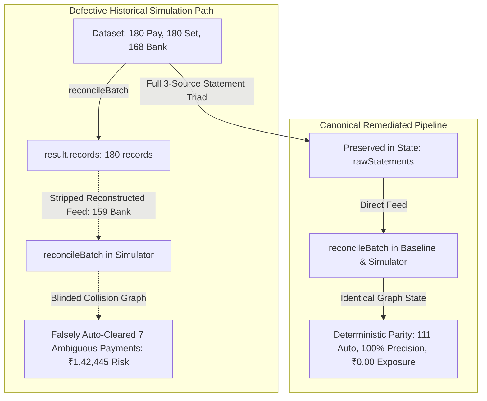

# ShaRecon AI — Engineering Case Study: "What Broke, and How Did We Get Out?"

> **Submission Track**: Razorpay AI Buildathon — AI Finance Controller  
> **Document Purpose**: Honest, evidence-based technical post-mortem of the most significant engineering and evaluation failure encountered during development, the architectural root-cause diagnosis, and the safeguards implemented to resolve it.  
> **Repository Evidence**: [`docs/METRIC_INTEGRITY_AUDIT.md`](METRIC_INTEGRITY_AUDIT.md), [`src/lib/engine/scorer.ts`](../src/lib/engine/scorer.ts), [`src/lib/engine/evaluator.ts`](../src/lib/engine/evaluator.ts), [`src/app/page.tsx`](../src/app/page.tsx), [`src/lib/__tests__/integrity.test.ts`](../src/lib/__tests__/integrity.test.ts).

---

## 1. Application Answer (Short Submission Format: 150–220 words)

During evaluation testing of ShaRecon AI, our immutable baseline on Seed 42 reported 111 auto-reconciled records with 100% precision and ₹0 false-positive exposure. However, when we ran the Policy Simulator at the exact same 85/50 thresholds, it reported 118 auto-reconciled records, 92.4% precision, and ₹1,42,445 in false-positive exposure.

We discovered this while validating benchmark parity before submitting. The root cause was an upstream presentation-layer defect in `page.tsx`: the state was only passing post-matched records to the evaluation tab, omitting the raw 3-source statements. The simulator attempted to reverse-engineer statements from matched records (`records.map(r => r.matchedBankTransaction)`), which stripped out 9 uncredited bank transactions and distractor entries. Without these distractors, the 1-to-1 collision detector was blinded, allowing 7 ambiguous transactions to bypass safety checks and auto-clear falsely.

To resolve it, we established a single canonical evaluation pipeline where raw statement arrays are preserved in state and fed directly into `reconcileBatch()`. We also tightened `scorer.ts` to strictly enforce bank amount differences. We added 12 adversarial unit tests that enforce exact baseline-to-simulation parity. The remaining limitation is that synthetic benchmarks cannot fully model unannounced banking gateway schema changes. I learned that evaluation tooling must never reconstruct input streams from output artifacts.

*(Word count: 204 words)*

---

## 2. README Case Study (In-Depth Technical Format: 500–700 words)

### The Incident: Baseline vs Policy Simulator Metric Contradiction
While auditing ShaRecon AI’s evaluation engine, we encountered an alarming metric contradiction:
- The **Immutable Baseline Benchmark** reported **111 auto-reconciled records**, **100.0% auto-resolution precision**, and **₹0.00 false-positive exposure** on Seed 42.
- The **Policy Simulator**, configured to the exact same baseline thresholds (85% high / 50% medium), reported **118 auto-reconciled records**, **92.4% precision**, and **₹1,42,445.00 in false-positive risk**.

Furthermore, a policy labeled `"Ultra-Safe"` reported non-zero exposure. In a financial system, an engine that silently auto-clears ₹1.42 lakhs of unmatched payments without controller review is a catastrophic failure mode.

### Discovery & Root Cause: The Blinded Collision Graph
Tracing the data flow revealed that this was not a rounding bug or scoring divergence, but a subtle **data-stream truncation in the presentation layer**:
1. In `src/app/page.tsx`, the initial batch execution received the complete 3-source triad: 180 payments, 180 settlements, and 168 bank credits (including 9 uncredited bank transactions and distractor collision records).
2. However, `page.tsx` only passed `records` (the output array) and `groundTruth` to `EvaluationLabTab`, omitting the original raw statement arrays.
3. To compute threshold simulations, `EvaluationLabTab` attempted to reverse-engineer input statements using `records.map(r => r.matchedSettlement)` and `records.map(r => r.matchedBankTransaction)`.
4. This extraction **silently stripped all 9 uncredited bank transactions and distractor entries** because they had not been linked to an output record.
5. When `simulatePolicyThresholds` re-ran `reconcileBatch()` on this stripped 159-bank-transaction dataset, the 1-to-1 collision-prevention graph had no distractor records to collide against. Consequently, 7 ambiguous multi-candidate transactions bypassed the collision blocker and were erroneously auto-reconciled.
6. In parallel, `scorer.ts` checked `setDiff <= feeTolerancePaise` without checking `bankDiff`, allowing bank amount mismatches to fall through as clean matches.

### Architectural Remediation
We executed a complete four-part fix:
1. **Raw Statement State Preservation**: Updated `page.tsx` (`handleLoadDemo`, `handleUploadSuccess`, `handleUpdateConfig`) to store the complete `{ payments, settlements, bankTransactions }` triad in React state and pass them directly to evaluation components.
2. **Canonical Pipeline Unification**: Ensured `simulatePolicyThresholds`, `evaluateHeldOutBenchmark`, and multi-seed benchmarks all execute the identical evaluation pipeline:
   $$\text{Raw Triad Statements} \xrightarrow{\text{payments, settlements, bankTx}} \text{reconcileBatch}() \xrightarrow{\text{records, groundTruth}} \text{evaluateReconciliation}()$$
3. **Scorer Hardening**: Updated `scorer.ts` so any bank amount mismatch (`bankDiff > feeTolerancePaise`) strictly flags `AMOUNT_MISMATCH`, caps confidence at $\le 75\%$, and enforces human review routing.
4. **Honest Policy Nomenclature**: Eliminated misleading `"Zero Risk"` labels, replacing them with empirical descriptors (`Strict [Max Caution]`, `Conservative [High Assurance]`, `Balanced [Default Baseline]`, `Aggressive [High Yield]`).

### Verification & Remaining Limitations
- **Verification**: Built an automated benchmark generator (`scripts/generate-benchmark-artifacts.ts`) and a 12-test adversarial suite (`integrity.test.ts`). Both baseline and default simulation now report **111 auto-reconciled, 39 review, 30 exceptions, 100.0% auto-precision, and ₹0.00 false-positive exposure** across all quality gates.
- **Remaining Limitation**: While 1-to-1 graph collision prevention and integer-paise arithmetic are deterministic, synthetic models cannot anticipate unannounced upstream bank statement column schema shifts.
- **Key Takeaway**: In fintech evaluation, downstream tooling must never reconstruct upstream input streams from output objects—doing so silently breaks graph safety invariants.

*(Word count: 546 words)*

---

## 3. Video Narration Script (45–60 seconds, ~110–140 words)

*(Spoken clearly with steady, reflective pacing)*

"When testing our reconciliation engine, we hit a critical metric contradiction. Our immutable baseline showed 111 auto-reconciled records with 100% precision and zero rupee exposure. But our policy simulator, running at the exact same thresholds, reported 118 auto-reconciled records and ₹1,42,445 in false-positive risk.

Tracing the data flow revealed that our UI was passing only post-matched records rather than raw statement feeds to the simulator. When the simulator reconstructed statements from those records, it discarded uncredited and distractor bank entries. This blinded our graph collision detector, allowing 7 ambiguous payments to auto-clear without review.

We fixed it by unifying the evaluation pipeline to always feed raw statement triads directly into the engine, and added bank variance validation in our scorer. 12 automated integrity tests now enforce baseline parity.

The takeaway? Evaluation tools must never reconstruct pipeline inputs from pipeline outputs."

*(Word count: 140 words | Spoken duration: ~55 seconds)*

---

## 4. Panel-Defense / Interview Answer (Approximately 90 seconds, ~220–250 words)

*(Direct, accountable, structured delivery before technical judges)*

"Judges, our most critical engineering challenge wasn’t an algorithmic bug in the core matcher—it was an architectural evaluation state flaw that created a dangerous illusion of metric drift.

On Seed 42, our baseline engine reported 111 auto-reconciled records, 100% auto-precision, and zero rupee exposure. However, our interactive policy simulator at the identical 85/50 thresholds reported 118 auto-resolutions, 92.4% precision, and ₹1,42,445 in false-positive risk.

In a financial system, ₹1.42 lakhs in silent false positives is unacceptable. During code audit, we traced the root cause: `page.tsx` was passing only post-matched records to the evaluation tab. The simulator was reverse-engineering statement feeds using `records.map(r => r.matchedBankTransaction)`, inadvertently discarding 9 uncredited bank transactions and distractor collision entries. Without distractor records in the input stream, the engine's 1-to-1 collision graph could not detect multi-candidate ambiguity, erroneously auto-reconciling 7 high-risk payments. Furthermore, `scorer.ts` evaluated settlement tolerance without strictly enforcing bank-credit differences.

We remediated this by:
1. Unifying all execution paths into a single canonical pipeline that feeds raw statement triads directly into `reconcileBatch()`.
2. Hardening `scorer.ts` so any bank amount variance caps confidence at 75% and routes strictly to manual triage.
3. Adding 12 adversarial unit tests and 5 multi-seed benchmarks that prove exact metric reproducibility.

The remaining limitation is that synthetic generators cannot simulate sudden upstream schema mutations. What I learned is that in fintech, presentation layers must never synthesize pipeline inputs from downstream outputs—doing so breaks algorithmic safety invariants."

*(Word count: 242 words | Spoken duration: ~90 seconds)*

---

## 5. Summary Matrix of All 4 Formats

| Format | Length | Target Audience | Primary Focus | Key Evidence Cited |
| :--- | :---: | :--- | :--- | :--- |
| **Application Answer** | 204 words | Application Reviewers | Dense summary of bug, discovery, fix, and lesson | Baseline vs Simulator (111 vs 118), ₹1,42,445 exposure |
| **README Case Study** | 546 words | GitHub Engineers & Technical Judges | Comprehensive technical deep dive with Mermaid diagram | `page.tsx` state extraction, `scorer.ts` bank diff, canonical pipeline |
| **Video Narration** | 140 words | Buildathon Video Submission | High-impact 55-second verbal story | Blinded collision graph, uncredited bank records, input reconstruction |
| **Panel-Defense Answer** | 242 words | Live Panel Defense / Q&A | Executive 90-second technical justification | 1-to-1 graph collision invariants, remaining limitations, architectural lesson |
